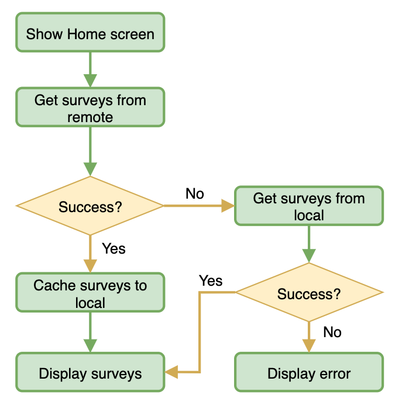

# Challenges – Nimble

## Results Report
[](https://travis-ci.com/github/duybui297/ChallengesNimble)

## BDD Specs

### Story: Users want to see the survey

### Narrative #1

```
As a user who has just logged into the app at the first time
I want the app to automatically load the latest surveys
So I can read and understand the app more
```

#### Scenarios (Acceptance criteria)

```
Given the user logs to the app the first time
Then the app should display the latest surveys from remote
 And save the cache with the new surveys
```

### Narrative #2

```
As a user has logged into the app
I want the app always show the latest saved survey
So I can always see surveys even when I haven't needed them from remote yet
```

#### Scenarios (Acceptance criteria)

```
Given the user doesn't need them from remote
 And there’s a cached version of the surveys
 And the cache is less than seven days old
When the user to see the surveys
Then the app should display the latest surveys saved

Given the user doesn't need them from remote
 And there’s a cached version of the surveys
 And the cache is seven days old or more
When the customer requests to see the surveys
Then the app should display a friendly error message

Given the customer doesn't have connectivity
 And the cache is empty
When the customer requests to see the surveys
Then the app should display an error message
```

## Use Cases

### Load Surveys From Remote Use Case

#### Data:
- URL
- User token type
- User access token

#### Primary course (happy path):
1. Execute "Load Surveys" command with above data.
2. System downloads data from the URL.
3. System validates downloaded data.
4. System creates surveys from valid data.
5. System delivers surveys.

#### Invalid data – error course (sad path):
1. System delivers invalid data error.

#### Invalid json format – error course (sad path):
1. System delivers invalid json format error.

#### No connectivity – error course (sad path):
1. System delivers connectivity error.
---

### Load Surveys Image Data From Remote Use Case

#### Data:
- URL

#### Primary course (happy path):
1. Execute "Load Surveys Image Data" command with above data.
2. System downloads data from the URL.
3. System validates downloaded data.
4. System delivers image data.

#### Cancel course:
1. System does not deliver image data nor error.

#### Invalid data – error course (sad path):
1. System delivers invalid data error.

#### No connectivity – error course (sad path):
1. System delivers connectivity error.

---

### Load Surveys From Cache Use Case

#### Primary course:
1. Execute "Load Surveys" command with above data.
2. System retrieves surveys from cache.
3. System validates cache is less than seven days old.
4. System delivers surveys from cached data.

#### Retrieval error course (sad path):
1. System deletes cache.
2. System delivers no survey.

#### Expired cache course (sad path): 
1. System delivers no surveys.

#### Empty cache course (sad path): 
1. System delivers no surveys.

---

### Load Image Surveys Data From Cache Use Case

#### Data:
- URL

#### Primary course (happy path):
1. Execute "Load Surveys" command with above data.
2. System retrieves data from the cache.
3. System delivers cached image data.

#### Cancel course:
1. System does not deliver data nor error.

#### Retrieval error course (sad path):
1. System delivers error.

#### Empty cache course (sad path):
1. System delivers not found error.

---

### Cache Surveys Use Case

#### Data:
- Survey

#### Primary course (happy path):
1. Execute "Save Surveys" command with above data.
2. System deletes old cache data.
3. System encodes image survey.
4. System saves new cache data.
5. System delivers success message.

#### Deleting error course (sad path):
1. System delivers error.

#### Saving error course (sad path):
1. System delivers error.

---

### Cache Surveys Image Data Use Case

#### Data:
- Image Data

#### Primary course (happy path):
1. Execute "Save Surveys Image Data" command with above data.
2. System caches surveys data.
3. System delivers success message.

#### Saving error course (sad path):
1. System delivers error.

---

### Validate Surveys Cache Use Case

#### Primary course:
1. Execute "Validate Surveys" command with above data.
2. System retrieves surveys data from cache.
3. System validates cache is less than seven days old.

#### Retrieval error course (sad path):
1. System deletes cache.

#### Expired cache course (sad path): 
1. System deletes cache.

---

## Flow chart

